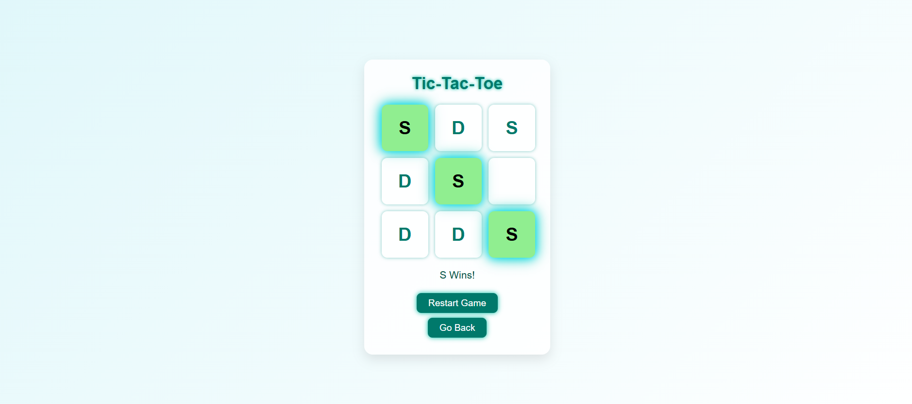

# 🎮 Tic-Tac-Toe Game

A **modern, responsive, and futuristic Tic-Tac-Toe** game built with **HTML, CSS & JavaScript**. Play with a friend or challenge a simple AI robot! Instead of X and O, the game uses **D and S** as symbols, with glowing neon effects.  

---

## ✨ Features

- Play with a friend or robot (AI).  
- Futuristic neon glow design.  
- Winning cells highlight with glowing effect.  
- Responsive for **mobile, tablet, and desktop**.  
- Restart game anytime.  
- Go back to the main page if needed.  

---

## ▶ Play Game From Here

Play directly online:

[🎮 Play Tic-Tac-Toe](https://thecodingdhami.github.io/Tic-Tac-Toe/)

---

## ⬇ Download Game

Download the andriod app to play offline:

[💾 Download Tic-Tac-Toe](https://github.com/<your-username>/<your-repo>/archive/refs/heads/main.zip)

---

## 🕹 How to Play

1. Open `(https://thecodingdhami.github.io/Tic-Tac-Toe/)` in your browser.  
2. Choose **game mode** (friend or robot).  
3. Click on empty cells to place your symbol (D or S).  
4. First player to get 3 in a row **wins**!  
5. Click **Restart Game** to play again anytime.  

---

## 📸 Screenshots

---

🛠 Technologies Used

---

📄 License
This project is licensed under the MIT License.

---

## © Dinesh Singh Dhami

